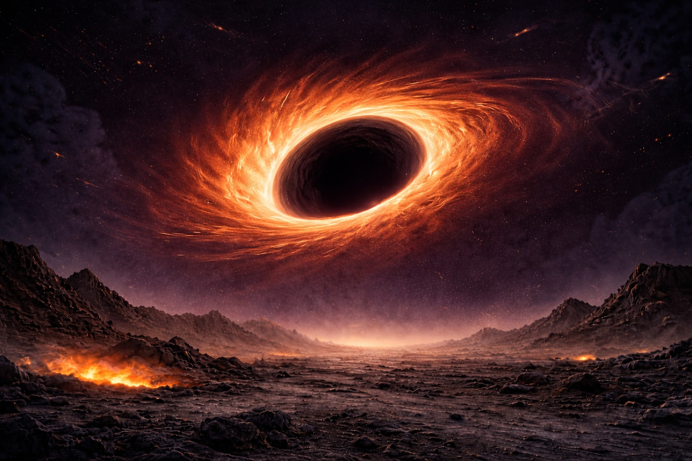
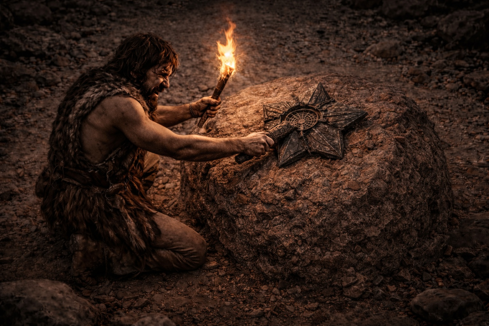
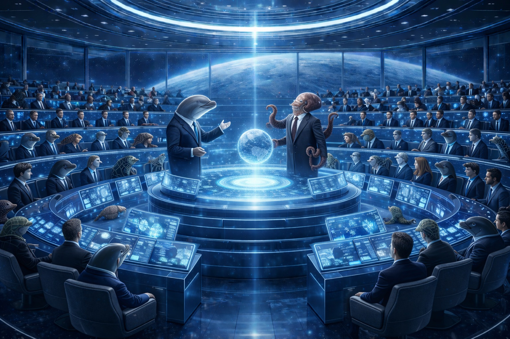

# JOURNEY
**Disclaimer:**
This is a work of fiction. Names, characters, places, events, and incidents are products of the author's imagination or are used fictitiously. Any resemblance to actual persons, living or dead, or actual events is purely coincidental. The story is intended for entertainment and creative exploration only.
## *A Tale Across Time and Space*
**Author:** Kamalakannan Vasavaiah and friends  
**Source:** https://github.com/JourneyingLife/journey  
*Narrative drafted with AI assistance (GitHub Copilot with Claude Sonnet 4.5; later revisions in Cursor). Illustrations generated with OpenAI ChatGPT 5.2 and Sora.*

---

## PROLOGUE: THE LAST PLANET
### *Era 5: Year 25357: Day 78*

Wee sensed an approaching apocalypse. The sky flickered constantly, hurling fireballs toward a horizon where something vast devoured everything that ventured near. His tribe, the most advanced species on their planet, still ignored these omens.

At sixteen, Wee disappointed his mother. While his cousins struck at prey at first sight, Wee had to clear a why before swinging his flint. That pause branded him a loser among his peers, except a handful who knew he could craft weapons that fell beasts of any size.

Even for Wee, the mysterious object near their hammock defied comprehension. Its symmetry surpassed anything he'd seen, yet its purpose remained elusive.

He turned it again. No edge made sense. He set it back by the hammock. Above the hills the sky kept tearing, and something vast went on eating the horizon.

## CHAPTER 1: THE COUNCIL OF VENUS-2
### *Era 4: Year 54728: Day 105*

Venus-2's core committee gathered in the virtual gallery, their faces heavy with concern. They had long ago transcended petty power struggles, serving their people with quiet dignity.

The Dolphins currently held governance while the Octopuses enjoyed their Rulers' Holiday—a cherished tradition where leadership alternated peacefully, allowing former administrators to rest and reflect before the cycle renewed. This wasn't about winning elections or clinging to authority; it was simply how responsible societies honored those who carried civilization's burden.

Their ancestors had learned from Earth's archives how this collaboration became possible. Earth scientists had enhanced the empathy pathways in dolphins and octopuses, bridging a gap that once kept marine minds from complex reasoning. The result was species that thought differently yet complemented each other perfectly. Where dolphins excelled at long-term strategic vision, octopuses mastered immediate problem-solving. Together, they accomplished what neither could do alone.

Chieftain Krish began the dire pronouncement. "Dear friends, our world is slowing down."

The silence deepened as everyone knew what this meant.

Krish continued. "The Gods seeded life here 200 million years ago, drawn by the optimal mix of elements and motions around our sun."

"But like those before us, we're sliding into tidal lock with the sun. Life will become impossible."

Octopus chief Lee, who joined remotely from his holiday retreat, cut to the point. "So our time here is running out. Haven't we identified PL67 as our next home. Are we preparing the endgame."

Endgame—a solemn word meaning only a select few who aboard the species ship would survive by leaving the dying planet, and even they would arrive as fossilized relics at the new home.

Krish nodded thoughtfully. "Thank you, Lee. But here's our challenge. Unlike previous migrations, 67 sits perilously close to Phoenix. Even if we successfully seed life there, evolution will not have matured to save life from extinction when the world gets to the brink of the event horizon."

"Our entire archive offers no solution for preserving life beyond 67."

"We need to find if any of the Gods survived a similar challenge."

"We must revisit..."

Lee interjected, "Journey."

"Journey," Krish echoed, the word heavy with significance.

Journey—an archaeological treasure buried in the Atlantis ocean depths, preserved scripts from the dawn of time. Octopuses had discovered the site millennia ago, yet its secrets remained only partially decrypted. Researchers believed it was a bequest from primordial ancestors who had traversed the stars, delivered to spare future civilizations from reinventing fundamental knowledge.

---

Far ahead in time, on the last habitable world, Wee sat by the hammock. His cousins called him to the hunt. He looked once more at the buried symmetry, found no name for it, and followed.

## CHAPTER 2: THE DIVE
### *Into the Depths of History*

At dawn, a crew descended toward the ancient archive. They were not touring. They were hunting one unread code in Journey—the part that might tell them how to keep life past 67.

The team combined biologists, astronomers, and physicists. Two teenagers joined as well. They brought the young because no one knew how long the dive would last.

Descending past the third mile, they caught the first glimpse of Linga rock.

Pilot Tory peered through binoculars and read the inscription aloud: "Change of magnetic flux passing through closed circuits produces electricity." The central beam and orbiting disks constituted the anatomy of the generator, while the current flowed like a serpent through its core.

Drawing closer, the seafloor blazed luminous despite the crushing depth. The gods had forged these structures in gold, ensuring they would resist erosion across countless millennia.

The species ship sculpture towered above them, depicting The Lord Shepherd surrounded by every form of life. Ancient engineers had transported DNA capsules across light-years to seed their world.

Rounding the next formation, they came into The Divine Prophet's Kaaba, enshrined within the Masjid al-Haram where all humans once pledged coexistence.

Lord Buddha followed, radiating enlightenment about the sovereignty of the inner self.

Einstein bore the nuclear formula that had equipped every civilization with abundant nuclear energy. Free-moving subatomic masses traveling at Light speed, breaching another mass's boundary, locked into an eternal dance treasured their combined kinetic energy for a shrewd engineer to harvest.

They had come for a secret still only partially decrypted. The gold halls offered many answers. They needed the one they did not yet know how to read.

Amid the countless sculptures streaming past, they nearly missed the ring-bound Dancing Lord until curious young Rafi questioned its significance amongst the other profound academic settings.

Tory, startled by the teenager's perceptive inquiry about the Shiv Tandav, wisely chose not to contaminate the kid's pristine curiosity with his own rudimentary knowledge. He mechanically murmured, "He who transcends comprehension," then rushed to contact Krish on teleview.

Krish pulled Lee into the line. "Go deeper. The old turtles go there to die. If anyone still holds that code, it is Daisy."

The dying turtle Daisy brought up all her might to open the coding in The Dancing Lord.

## CHAPTER 3: THE ORIGIN
### *Understanding the Cosmic Dance*

Through Daisy they saw how solar planet dwellers had pursued a fundamental mystery: how larger celestial bodies attracted smaller ones without visible tethers. They still could not say what pulled world toward world. While light traveled an astonishing three hundred million meters per second, cosmic bodies just stayed put drifting around same spot.

Mars's greatest minds debated the universe's origin. They observed cosmos exhibiting recursive patterns—solar planetary orbits mirroring subatomic particle trajectories.

They concluded that shapes and motion were merely impressions perceived by conscious beings. The universe appeared to be an endlessly recurring microcosmic pattern, as the Dancing Deity depicted—with ripples propagating omnidirectionally, generating the illusion of form and movement across higher dimensions. This theory elegantly explained both black holes and wormholes: black holes materialized at ripple collapse points, while wormholes formed along the pathways these distortions carved through spacetime, reemerging in alternate dimensions and cosmic geographies.

The puzzle of how the universe originated seemed less perplexing than explaining why a silent, static void didn't exist instead.

### *The Great Awakening*

But the Earth Gods' greatest triumph wasn't understanding the cosmos as preserved in ancestral scripts—it was transcending their own nature through centuries of bloodshed.

For millennia, Earth's kingdoms had waged brutal competition, each projecting supremacy through arsenals capable of obliterating continents. Nuclear warheads threatened total extinction. The arms race had devolved into a suicidal sprint.

But a shift began when a seven-year-old girl in a war-torn region needed a heart transplant. Her match came from a soldier of the "enemy" nation who had fallen shielding civilians. As her new heart beat, it opened up the minds to envision a long lasting wisdom.

Families realized the stranger who saved their child wore yesterday's enemy uniform. Weapons factories fell silent.

Within three generations, the phrase "enemy nations" became an archaic terminology. How do you despise the people whose gift gave your daughter another sunrise?

Daisy's voice thinned. "Go find a friendly wormhole to send your species ship through."

She drew one more breath. "Make the scriptures layman-readable. Half-baked knowledge breeds holy wars. The same cosmic scripts arrived in different lands. Each society called its reading the true God. They were fighting over translations of one message. Cost them millions of lives to learn what should have been clear from the start."

Elated by discovering a viable pathway to 67, the biologists began selecting the DNA sequences to transport.

Space engineers calculated they could traverse the journey in seven thousand years via wormhole W31, which exhibited reversal characteristics matching 67's properties.

## CHAPTER 4: THE MACHINE
### *Merging Biology with Technology*

Yet a new obstacle emerged: despite delivering diverse genetic material to 67, the terrain would require a billion years to become habitable—but the world would be consumed by Phoenix Cluster in merely fifty million. Redirecting this final sanctuary before annihilation remained unsolved.

Right at the moment, AI engineer Nova voiced a half-formed concept to the senior council. Instead of waiting for organic evolution to rescue their future habitat, why not deploy intelligent machines for the task? Her challenge was the thinking machines they already knew—too heavy to ship and keep asleep across a thousand years.

Yet Chieftain Krish and Chief Lee exchanged knowing glances, as if they'd already glimpsed the solution.

Krish began illuminating Nova's path. "Your proposal fits perfectly. Don't worry about infrastructure—we're not the first to solve this. The answer lies in the element scripture. We just need to encode the five elemental interactions onto the sixth: the destiny-carrier."

Lee named the six in one breath. "Fire in the heart. Ground in the stomach. Air in the lungs. Water in the kidneys. Electricity—sky in the old Indian scripts, wood in the Chinese—working through the liver. And the sixth, the Destiny carrier, holds the blueprint of life. Early humans mistook the one in Mars Lord Muruga's hand for a weapon."

The vessel they needed was not a rack of sleeping machines. It was life itself.

Nova, emboldened, posed an ambitious question. "If we understand life's elemental foundation, why can't we construct living organisms directly instead of machines?"

Krish smiled knowingly. "Creating life remains nature's exclusive mystery. Living forms possess the most efficient motor system ever devised. We've never engineered anything approaching half that efficiency."

Nova's idea helped to seed the minimal machine in 67 and scheme its evolution alongside organic species. That was one step forward.

---

On that later world the sky had grown worse. Fireballs came closer. Wee still did not know what slept under the hammock. He only knew he could not leave it.

## CHAPTER 5: STRUGGLE OF THE LAST LIFE
### *Return to Wee's World*

The apocalypse arrived sooner than Wee anticipated. Volcanoes erupted across distant horizons, belching dark plumes skyward. Nomads and herds stampeded in terror.

Then the hunters came. They wanted the high ground around the hammocks, and they did not ask.

Wee's cousins looked to him. The tribe needed weapons, and his craftsmanship had become invaluable. He thought of the object in the dirt—the only thing he had ever seen that was not stone, not bone, not flint.

He resolved to weaponize the mystery object buried at their hammock for their defense.

They gathered around it. They strained together to wrench the lever from its holding ground. The object warmed. A faint light rose from the seam.

The lever moved.

---

## CHAPTER 6: THE GOD'S HEARTBREAK
### *When Plans Meet Reality*

Nova saw it before the others—the last tribe, hands on her machine as if it were a spear. She felt devastated knowing her creation would become a weapon in the last civilization's hands.

Despite her minimalist machine rapidly evolving on 67 thanks to abundant radioactive minerals, its bionic awakening wouldn't trigger until organic species reached technological sophistication. The machine required physical activation which can happen as a byproduct of any survival behavior such as hunting and territorial defense.

Mary, the lead anthropologist, urged her to go forward despite these concerns. "Our ultimate objective is what matters. We must follow Jupiter-2's precedent—there's no alternative."

Jupiter-2 had harbored life after Jupiter-1's demise, but survived only briefly. Without sophisticated vessels that could be fueled with advanced nuclear reactors, they triggered a crude exo-fusion to hurl their primitive space shuttle into the cosmic void. The asteroids they left behind became hazards haunting subsequent civilizations throughout the solar system. Where those travelers ultimately arrived remains unknown.

---

## EPILOGUE: THE RETURN TICKET
### *A Journey Home*

Krish proposed routing 67's inhabitants through W31's twin black hole B31, sending them back toward their original constellation where Venus-3 would await them, fully habitable in the distant future.

The lever Wee's people struggled to pull to unearth was designed to activate an exo-fusion engine buried beneath their settlement. This self-evolved machine seeded on Nova's idea had lain dormant after initial build, waiting to propel their world into B31.

Wee would never know he was the Reverse God of all earlier civilizations who had fought with time to plant that device in his world. In contrast to the Gods who passed wisdom forward through time, he was venerated backward—their hope to preserve the final spark of life as the last habitable planet plummeted toward Phoenix Cluster, five billion years after Earth.

**That lever is their passage home. Will they succeed? Let's find out in another five billion years while journeying together revisiting via life elements in our repeating births.**

---

## ABOUT THE NOVEL

*The Journey* is an epic science fiction tale spanning billions of years and multiple civilizations. It weaves together themes of:

- **Cyclical Time**: How civilizations pass knowledge to future species
- **Cosmic Evolution**: The interconnection between organic and artificial intelligence
- **Ancient Wisdom**: How religious and scientific knowledge encode universal truths
- **Survival**: The desperate measures species take to preserve life

This story explores the concept of "Reverse Gods" - beings from the future who are worshipped by the past, and how the universe itself may be a repeating pattern across dimensions.

### Key Themes

**The Cosmic Cycle**: Life's journey through the solar system followed the sun's cooling trend—as temperatures cooled to human-compatible conditions, habitable zones shifted from outer to inner planets. When our sun's habitable window closed, civilizations migrated to Venus-2 in another solar system, and finally to PL67 approaching the Phoenix Cluster black hole. Each civilization plants the seeds for the next, passing knowledge and DNA through wormholes and black holes across dimensions and eras

**Technology & Biology**: The convergence of artificial and organic intelligence as a solution to survival across cosmic timescales

**The Six Elements of Life**: Fire (passion/heart), Ground (stability/stomach), Air (freedom/lungs), Water (adaptability/kidneys), Electricity/Sky (growth/liver), and Destiny (the carrier of all elements)

### Character Guide

- **Wee**: A young thinker in the last era, unknowingly the Reverse God
- **Chieftain Krish**: Dolphin leader of Venus-2 in Era 4
- **Chief Lee**: Octopus leader, wise and strategic
- **Nova**: AI engineer who devises the bionic evolution plan
- **Daisy**: Ancient turtle with knowledge of the cosmic codes
- **Tory/Rafi**: Pilots and explorers who discover the Dancing Lord's secrets

---

## GLOSSARY

**XOR logic gates**: Exclusive-or operations that enable 'yes-but-not-both'. A result is true only when one condition is true and the other is not—the kind of distinction that allows complex reasoning. Early marine brains, like those of most animals, ran on sodium-based circuitry and lacked the potassium-based networks that support XOR. Earth scientists later calibrated potassium channel thresholds so even non-primate neurons could perform anticoincidence detection and XOR operations.

**Gravity (asymmetric collisions)**: One theory in the story holds that gravity forms when free-moving masses strike a body more on its far side than on the near sides facing each other, raising pressure on the far-side surfaces.

**Large language models**: The thinking machines Nova first imagined. In her era a typical model used about 70 billion parameters, 140 GB of GPU memory, 4 GPUs per instance, and 50 kW per serving cluster—too much mass and power to ship dormant across millennia.

**The six elements**: Fire (passion, heart; about seventy beats a minute). Ground (stability, stomach; food broken into the energy the body spends). Air (freedom, lungs; about twenty thousand breaths a day). Water (adaptability, kidneys; about two hundred liters of blood filtered daily). Electricity (love and nerve signals; sky in ancient Indian scripts, wood in Chinese scripts; the liver running hundreds of transformations at once). Destiny carrier (the blueprint of new life; early humans mistook its form in Mars Lord Muruga's hand for a weapon).

**ATP / ADP**: ATP (adenosine triphosphate) is the energy currency of living cells. When ATP implodes into ADP (adenosine diphosphate), it releases energy that powers muscular contraction while the leftover heat feeds metabolism. This is the motor Krish says no machine has matched.

---

*"In the dance of the cosmos, every ending is a beginning, and every species carries the hope of all who came before."*

---

## NOTES ON THE ILLUSTRATIONS

The images in this novel were generated with OpenAI ChatGPT 5.2 and Sora to match each scene. They are story illustrations, not scientific diagrams.

### Art approach by section

- **Prologue & Chapter 5**: Gritty, post-apocalyptic realism
- **Chapter 1**: Sleek, bioluminescent futurism
- **Chapter 2**: Majestic underwater archaeological photography style
- **Chapter 3**: Abstract cosmic art with scientific accuracy
- **The Great Awakening**: War and arsenals first, then the turn toward peace and shared care
- **Chapter 4**: Technical diagrams merged with organic patterns
- **Chapter 6**: Emotional character-focused art
- **Epilogue**: Epic space opera cinematography

---

## REFERENCES

**Neuroscience and Ion Channels (Inspiration for Neural Computation):**

1. OpenStax. *Anatomy & Physiology 2e* (nervous tissue, membrane potential, ion channels, action potentials). https://openstax.org/details/books/anatomy-and-physiology-2e
2. Harikesh, P.C., Gao, D., Wu, H.Y., Yang, C.Y., Tu, D., et al. (2025). "Single organic electrochemical neuron capable of anticoincidence detection." *Science Advances* (open access). https://doi.org/10.1126/sciadv.adv3194
3. Bellec, G., Salaj, D., Subramoney, A., Legenstein, R., & Maass, W. (2018). "Long short-term memory and learning-to-learn in networks of spiking neurons." arXiv:1803.09574. https://arxiv.org/abs/1803.09574

These references provide free, English background on ion channels and spiking neural computation that inspired the novel's neural enhancement concepts.

---

**Black Holes, Hawking Radiation, and Wormholes (Background):**

1. NASA Science. "Black Holes." https://science.nasa.gov/universe/black-holes/
2. Lobo, F.S.N. (2007). "Exotic solutions in General Relativity: Traversable wormholes and warp drive spacetimes." arXiv:0710.4474. https://arxiv.org/abs/0710.4474

---

**Large Language Models:**

1. Brown, T., Mann, B., Ryder, N., et al. (2020). "Language models are few-shot learners." *Advances in Neural Information Processing Systems*, 33, 1877-1901. https://arxiv.org/abs/2005.14165

---

**Panspermia / Seeding Life (Speculative Context):**

1. Wikipedia contributors. "Panspermia." https://en.wikipedia.org/wiki/Panspermia

---

**Cellular Energy, ATP, and Chemiosmosis:**

1. Mitchell, P. (1978). "David Keilin’s Respiratory Chain Concept and Its Chemiosmotic Consequences" (Nobel Lecture). https://www.nobelprize.org/prizes/chemistry/1978/mitchell/lecture/ (PDF: https://www.nobelprize.org/uploads/2018/06/mitchell-lecture.pdf)
2. OpenStax. *Biology 2e* — "7.4 Oxidative Phosphorylation" (chemiosmosis, ATP synthase, ADP→ATP). https://openstax.org/books/biology-2e/pages/7-4-oxidative-phosphorylation
3. OpenStax. *Anatomy & Physiology 2e* — "10.3 Muscle Fiber Contraction and Relaxation" (ATP hydrolysis, ATP→ADP cross-bridge cycle). https://openstax.org/books/anatomy-and-physiology-2e/pages/10-3-muscle-fiber-contraction-and-relaxation

---

**Habitable Zones and Planetary Habitability:**

1. NASA Exoplanet Exploration. "Habitable Zone." https://exoplanets.nasa.gov/what-is-an-exoplanet/habitable-zone/
2. Kopparapu, R.K., Ramirez, R., Kasting, J.F., et al. (2013). "Habitable Zones around Main-sequence Stars: New Estimates." arXiv:1301.6674. https://arxiv.org/abs/1301.6674

---

**Traditional Chinese Medicine and Five Element Theory:**

1. National Center for Complementary and Integrative Health (NCCIH). "Traditional Chinese Medicine: What You Need To Know." https://www.nccih.nih.gov/health/traditional-chinese-medicine-what-you-need-to-know
2. Wikipedia contributors. "Wuxing (Chinese philosophy)." https://en.wikipedia.org/wiki/Wuxing_(Chinese_philosophy)

These English, free references summarize Five Element theory (Wu Xing) used as inspiration for the novel's elemental framework.

---

**Organ Transplantation and Global Collaboration:**

1. WHO Global Observatory on Donation and Transplantation. (2023). "International Report on Organ Donation and Transplantation Activities." https://www.transplant-observatory.org
2. World Health Organization (WHO). "Organ donation and transplantation" (overview and guidance). https://www.who.int/health-topics/transplantation

These sources inform the Global Organ Collaboration Network depicted in the Gandhian Revolution section.

---

**End of Novel**
